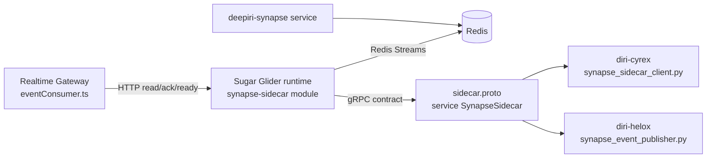

# Sugar Glider / Synapse Repo Decision

Last updated: 2026-04-08
Owner: Platform Engineering (workstream lead: Kyle Barnette)

## Goal
Answer the architecture decision requested by leadership:
1. Should `deepiri-sugar-glider` be its own repo?
2. Should `deepiri-synapse` be its own repo/package?
3. Where should Sugar Glider live relative to Synapse?

This document is the running implementation artifact for tasks `A1-A8`.

## Task Status
- [x] `A1` Capture current-state architecture
- [ ] `A2` Inventory compatibility anchors
- [ ] `A3` Define the decision rubric
- [ ] `A4` Evaluate Option 1 (stay in `deepiri-platform`)
- [ ] `A5` Evaluate Option 2 (extract Sugar Glider only)
- [ ] `A6` Evaluate Option 3 (extract Sugar Glider + Synapse contract)
- [ ] `A7` Choose recommendation and migration order
- [ ] `A8` Publish decision package (memo + boss summary)

## A1 Output: Current-State Architecture

### 1) Runtime placement today
- Sugar Glider runtime is implemented inside:
  - `platform-services/backend/deepiri-realtime-gateway/synapse-sidecar`
- Realtime Gateway consumes Sugar Glider over HTTP endpoints (`/readyz`, `/v1/read`, `/v1/ack`) via:
  - `platform-services/backend/deepiri-realtime-gateway/src/streaming/eventConsumer.ts`
- RTG environment supports both naming surfaces:
  - Preferred: `SYNAPSE_SUGAR_GLIDER_URL`
  - Compatibility fallback: `SYNAPSE_SIDECAR_URL`

### 2) Local deployment topology
- Local compose stack for this lane:
  - `docker-compose.rtg-sugar-glider.local.yml`
- Service name is `synapse-sugar-glider`, with `synapse-sidecar` kept as network alias for compatibility.
- Healthcheck still uses the legacy binary entrypoint:
  - `/app/sidecar healthcheck`

### 3) Consumer integrations
- **Cyrex** currently consumes the gRPC contract using sidecar-named generated stubs:
  - `diri-cyrex/app/integrations/streaming/synapse_sidecar_client.py`
  - imports `proto.synapse.v1.sidecar_pb2` and `sidecar_pb2_grpc`
  - stub type `SynapseSidecarStub`
- **Helox** currently publishes events through sidecar-mode support:
  - `diri-helox/integrations/synapse_event_publisher.py`
  - transport mode: `SYNAPSE_TRANSPORT=sidecar`
  - default endpoint fallback: `http://synapse-sidecar:8081`
  - gRPC uses sidecar protobuf stubs

### 4) Contract ownership shape today
- Canonical contract file is still sidecar-named:
  - `platform-services/backend/deepiri-realtime-gateway/synapse-sidecar/proto/synapse/v1/sidecar.proto`
- Service name in the proto is:
  - `SynapseSidecar`
- Generated client artifacts are committed under both:
  - `diri-cyrex/app/integrations/streaming/gen/...`
  - `diri-helox/integrations/streaming/gen/...`

### 5) Repo topology relevant to this decision
- `deepiri-platform` tracks multiple component repos as gitlinks/submodules.
- Current gitlinks include:
  - `diri-cyrex`, `diri-helox`, `deepiri-modelkit`, `deepiri-core-api`, and multiple backend/shared services.
- `.gitmodules` does not currently list every gitlink path, which indicates mixed historical submodule management and increases change-management risk for extraction work.

### 6) Current-state dependency map

## A1 Conclusions
- Sugar Glider is operationally embedded in RTG today, not yet separated as an independently owned runtime repo.
- The contract and consumer ecosystem are still sidecar-named at the protobuf and generated-client layers.
- Any repo extraction decision must account for cross-repo client regeneration and compatibility sequencing (Cyrex + Helox), not only RTG code movement.
