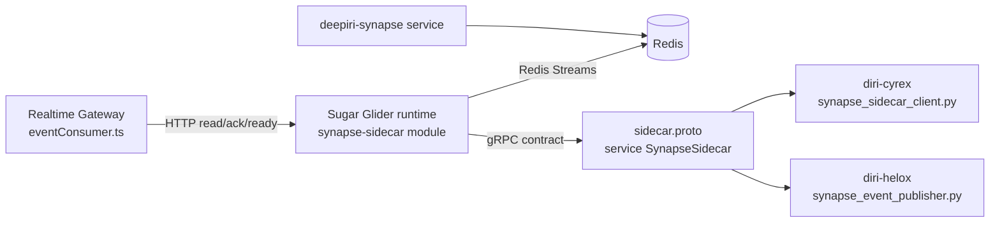

# Sugar Glider / Synapse Repo Decision

Last updated: 2026-04-08
Owner: Platform Engineering (workstream lead: Kyle Barnette)

## Goal
Answer the architecture decision requested by leadership:
1. Should `deepiri-sugar-glider` be its own repo?
2. Should `deepiri-synapse` be its own repo/package?
3. Where should Sugar Glider live relative to Synapse?

This document is the running implementation artifact for tasks `A1-A8`.

## Task Status
- [x] `A1` Capture current-state architecture
- [x] `A2` Inventory compatibility anchors
- [x] `A3` Define the decision rubric
- [ ] `A4` Evaluate Option 1 (stay in `deepiri-platform`)
- [ ] `A5` Evaluate Option 2 (extract Sugar Glider only)
- [ ] `A6` Evaluate Option 3 (extract Sugar Glider + Synapse contract)
- [ ] `A7` Choose recommendation and migration order
- [ ] `A8` Publish decision package (memo + boss summary)

## A1 Output: Current-State Architecture

### 1) Runtime placement today
- Sugar Glider runtime is implemented inside:
  - `platform-services/backend/deepiri-realtime-gateway/synapse-sidecar`
- Realtime Gateway consumes Sugar Glider over HTTP endpoints (`/readyz`, `/v1/read`, `/v1/ack`) via:
  - `platform-services/backend/deepiri-realtime-gateway/src/streaming/eventConsumer.ts`
- RTG environment supports both naming surfaces:
  - Preferred: `SYNAPSE_SUGAR_GLIDER_URL`
  - Compatibility fallback: `SYNAPSE_SIDECAR_URL`

### 2) Local deployment topology
- Local compose stack for this lane:
  - `docker-compose.rtg-sugar-glider.local.yml`
- Service name is `synapse-sugar-glider`, with `synapse-sidecar` kept as network alias for compatibility.
- Healthcheck still uses the legacy binary entrypoint:
  - `/app/sidecar healthcheck`

### 3) Consumer integrations
- **Cyrex** currently consumes the gRPC contract using sidecar-named generated stubs:
  - `diri-cyrex/app/integrations/streaming/synapse_sidecar_client.py`
  - imports `proto.synapse.v1.sidecar_pb2` and `sidecar_pb2_grpc`
  - stub type `SynapseSidecarStub`
- **Helox** currently publishes events through sidecar-mode support:
  - `diri-helox/integrations/synapse_event_publisher.py`
  - transport mode: `SYNAPSE_TRANSPORT=sidecar`
  - default endpoint fallback: `http://synapse-sidecar:8081`
  - gRPC uses sidecar protobuf stubs

### 4) Contract ownership shape today
- Canonical contract file is still sidecar-named:
  - `platform-services/backend/deepiri-realtime-gateway/synapse-sidecar/proto/synapse/v1/sidecar.proto`
- Service name in the proto is:
  - `SynapseSidecar`
- Generated client artifacts are committed under both:
  - `diri-cyrex/app/integrations/streaming/gen/...`
  - `diri-helox/integrations/streaming/gen/...`

### 5) Repo topology relevant to this decision
- `deepiri-platform` tracks multiple component repos as gitlinks/submodules.
- Current gitlinks include:
  - `diri-cyrex`, `diri-helox`, `deepiri-modelkit`, `deepiri-core-api`, and multiple backend/shared services.
- `.gitmodules` does not currently list every gitlink path, which indicates mixed historical submodule management and increases change-management risk for extraction work.

### 6) Current-state dependency map

## A1 Conclusions
- Sugar Glider is operationally embedded in RTG today, not yet separated as an independently owned runtime repo.
- The contract and consumer ecosystem are still sidecar-named at the protobuf and generated-client layers.
- Any repo extraction decision must account for cross-repo client regeneration and compatibility sequencing (Cyrex + Helox), not only RTG code movement.

## A2 Output: Compatibility Anchor Inventory

### 1) Proto + contract anchors (intentionally still sidecar-named)
- Canonical proto path remains:
  - `platform-services/backend/deepiri-realtime-gateway/synapse-sidecar/proto/synapse/v1/sidecar.proto`
- Service name in proto remains:
  - `SynapseSidecar`
- Generated Python modules remain sidecar-named:
  - `sidecar_pb2.py`
  - `sidecar_pb2_grpc.py`

Migration sensitivity:
- Renaming proto package/service/module names in this phase would require synchronized regeneration and rollout across RTG, Cyrex, and Helox.
- Keeping proto/stub names stable during architecture decision work reduces blast radius.

### 2) Consumer/client naming anchors (Cyrex + Helox)
- Cyrex integration uses sidecar client naming:
  - `diri-cyrex/app/integrations/streaming/synapse_sidecar_client.py`
  - `SynapseSidecarStub` and `sidecar_pb2*` imports.
- Helox integration uses sidecar transport + stubs:
  - `diri-helox/integrations/synapse_event_publisher.py`
  - gRPC imports from sidecar-named generated modules.

Migration sensitivity:
- Consumer naming and generated imports are hard compatibility anchors.
- Any contract rename needs cross-repo PR coordination, release ordering, and rollback-safe dual-support.

### 3) Environment/config anchors
- RTG supports:
  - preferred `SYNAPSE_SUGAR_GLIDER_URL`
  - compatibility `SYNAPSE_SIDECAR_URL`
- Cyrex + Helox + scripts still rely on sidecar env/config surfaces:
  - `SYNAPSE_TRANSPORT=sidecar`
  - `SYNAPSE_SIDECAR_URL`
  - `SYNAPSE_SIDECAR_TIMEOUT_SEC`
  - `SYNAPSE_SIDECAR_SENDER`
  - `SYNAPSE_GRPC_ADDR`

Migration sensitivity:
- Env key migration must be staged; immediate hard rename risks local/dev breakage and silent misconfiguration.
- Dual-key or adapter-period support is required until all consumers are aligned.

### 4) Service alias + ops anchor points
- Compose and operational scripts still keep sidecar aliasing:
  - `docker-compose.rtg-sugar-glider.local.yml` includes `synapse-sidecar` alias.
  - `scripts/dev/preflight.sh` and `scripts/dev/stack_watchdog.sh` recognize sidecar naming.
- Make targets preserve sidecar command surfaces:
  - `rtg-sidecar-*` targets in `Makefile`.

Migration sensitivity:
- Ops/tooling assumptions are distributed and script-bound.
- Alias removal must wait for a coordinated scripts/docs update wave.

### 5) Binary/runtime anchors
- Sugar Glider container still builds/executes sidecar binary name:
  - `platform-services/backend/deepiri-realtime-gateway/synapse-sidecar/Dockerfile`
  - `/out/sidecar`, `/app/sidecar`, healthcheck/entrypoint use `sidecar`.

Migration sensitivity:
- Binary rename is low business value right now and creates avoidable deployment/test churn.
- Keep binary compatibility until architecture path is finalized.

### 6) WAL compatibility anchor
- WAL implementation intentionally supports legacy and canonical filenames:
  - `platform-services/backend/deepiri-realtime-gateway/synapse-sidecar/internal/wal/wal.go`
  - canonical `sugar-glider.wal.jsonl`
  - legacy fallback `sidecar.wal.jsonl`

Migration sensitivity:
- Legacy WAL fallback is required for continuity and rollback safety.
- Removing fallback before migration completion risks local state loss and replay issues.

### 7) Runtime consumer identity anchor
- RTG consumer transport naming intentionally remains sidecar-aligned:
  - `platform-services/backend/deepiri-realtime-gateway/src/streaming/eventConsumer.ts`
  - consumer name/suffix compatibility remains tied to `sidecar`.

Migration sensitivity:
- Consumer naming affects stream group/offset semantics and operational observability.
- Name changes require explicit migration strategy for stream/consumer continuity.

## A2 Conclusions
- Sidecar naming persists by design at contract, env, ops, and runtime identity layers.
- These anchors are compatibility-critical; they should remain stable during architecture decision work (`A3-A8`).
- Architecture recommendation should treat naming cleanup as a later, explicit migration lane with dual-support and rollback gates.

## A3 Output: Decision Rubric

### 1) Scoring scale and evaluation method
- Score each criterion on a `1-5` scale:
  - `1` = poor fit / high risk
  - `3` = acceptable with mitigations
  - `5` = strong fit / low risk
- Weighted total per option:
  - `weighted_score = sum(score * weight)`
- Maximum possible total:
  - `5.00` (weights sum to `1.00`)

### 2) Criteria and weights (locked for A4-A6)

| Criterion | Weight | What we measure |
|---|---:|---|
| Ownership clarity | 0.15 | Single-team accountability, boundary clarity, and operational ownership. |
| Release cadence fit | 0.10 | Ability for Sugar Glider/Synapse changes to ship at the right pace without blocking unrelated services. |
| Versioning model quality | 0.10 | Clarity and enforceability of contract/runtime versioning across repos. |
| CI/CD complexity | 0.15 | Pipeline count, integration complexity, QA burden, and failure surface. |
| Local developer cost | 0.10 | Setup friction, mock/dependency burden, and inner-loop speed for contributors. |
| Cross-repo coordination overhead | 0.10 | Number of synchronized PRs/releases needed for normal feature work. |
| Migration risk | 0.20 | Likelihood and impact of regressions while moving to the target structure. |
| Rollback safety | 0.10 | Ability to revert quickly and safely under production or QA failure. |

Weighting rationale:
- Migration and execution safety are intentionally weighted highest (`migration risk` + `rollback safety` + `CI/CD complexity` = `0.45`) because this lane has active compatibility anchors and multi-repo consumers.
- Ownership and release needs are second-priority (`0.25`) so architecture remains operationally sustainable after cutover.
- Developer and coordination costs remain material (`0.20`) but should not override safety.

### 3) Mandatory gates (must pass regardless of score)
- **Compatibility gate:** Option must preserve A2 anchors during migration or provide explicit dual-support sequence.
- **No-main-direct gate:** Implementation remains branch/PR based (`feature -> dev`), with no direct `main` edits.
- **Consumer continuity gate:** Cyrex and Helox must retain working contract integration through each migration phase.
- **Rollback gate:** Each migration phase must define exact rollback action and data safety posture (including WAL continuity).

### 4) Tie-break rules
- If weighted totals are within `0.25`, choose the option with lower `migration risk`.
- If still tied, choose the option with higher `rollback safety`.
- If still tied, prefer lower `cross-repo coordination overhead` for next-quarter execution speed.

### 5) Output format to use in A4-A6
For each option we will publish:
- criterion-by-criterion score table (`1-5` + weighted subtotal),
- explicit risks and mitigations,
- ownership model,
- required migration sequence and rollback steps.

## A3 Conclusions
- The rubric is now fixed and objective enough to compare all three architecture options consistently.
- Safety constraints from A2 are elevated into mandatory gates, so high-level preference cannot override compatibility/rollback requirements.
- `A4-A6` can now proceed without inventing new evaluation criteria midstream.
